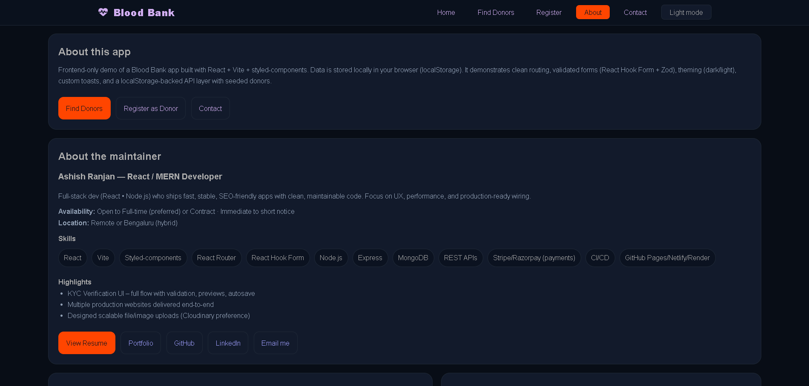

# Blob Generator



-   **Live:** https://a2rp.github.io/blood-bank/
-   **Repo:** https://github.com/a2rp/blood-bank

React-based blood bank UI built with styled-components.
Find & filter donors, register new donors with validation, manage contact messages, and edit donor details -
all saved in localStorage. Vite-powered and GitHub Pages–ready.

-   React Hook Form + Zod validation
-   Donor details modal with edit & save
-   Confirm dialog (self-made modal) before destructive actions
-   Custom toasts (no UI library)
-   localStorage seed + persistence
-   BrowserRouter + GH Pages SPA fallback
-   All styles scoped with styled.js pattern (export const Styled = { Wrapper: styled.div`` })

## ✨ Features

-   Donors page: top filter bar + responsive card grid
    -- Filters: Search (name/phone/email), Blood Group, City, Availability
    -- Card click → modal with complete details + edit & save
-   Register Donor form:
    -- Fields: Name, Age, Gender, Blood Group, Phone, Email, City, Last Donation, Available, Notes
    -- Tight validation (RHF + Zod), clean errors, success toast
-   Contact:
    -- Form to submit a message → saved in localStorage
    -- Messages list under the form with Refresh, Delete, Clear all (each behind confirm)
-   Theming:
    -- Dark/Light via ThemeProvider, GlobalStyles
    -- Native controls tuned for dark mode (color-scheme)
-   Routing:
    -- react-router-dom (BrowserRouter) with GH Pages–friendly setup

## 🧱 Tech Stack

-   React (Vite)
-   styled-components (GlobalStyles + themes)
-   react-router-dom (BrowserRouter)
-   react-hook-form + Zod
-   localStorage-backed “API” layer

## 🚀 Getting Started

```bash
# clone
git clone https://github.com/a2rp/blood-bank
cd blood-bank

# install
npm i

# dev
npm run dev

# build
npm run build

# preview production build
npm run preview
```
