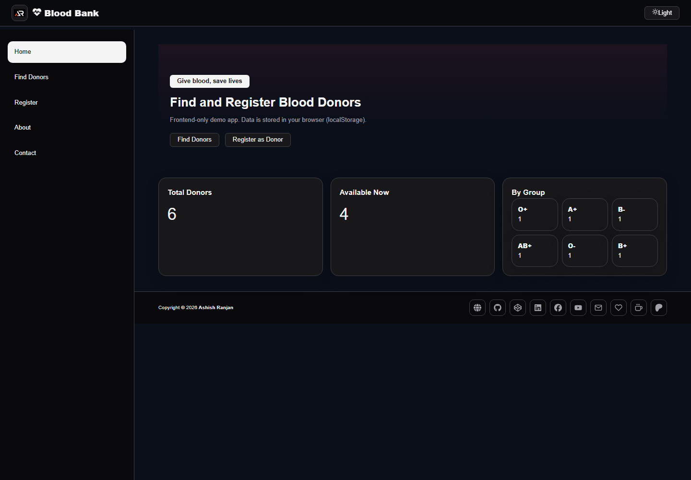

# Blood Bank

A React and Vite blood donor directory for finding donors, registering donor details, and managing contact messages locally in the browser.



## Features

- Responsive fixed header with desktop sidebar and mobile menu
- Donor search and filters by blood group, city, and availability
- Validated donor registration and editing
- Contact message management with local persistence
- Light and dark themes with a floating Go to top button

## Tech stack

React, Vite, React Router, styled-components, React Hook Form, Zod, React Icons, and localStorage.

## Run locally

```bash
npm install
npm run dev
```

Build with `npm run build` and deploy to GitHub Pages with `npm run deploy`.

## Deployment

- Live site: https://a2rp.github.io/blood-bank/
- Repository: https://github.com/a2rp/blood-bank
- License: MIT

## Links

- Portfolio: https://www.ashishranjan.net/
- GitHub: https://github.com/a2rp
- CodePen: https://codepen.io/ash1198
- LinkedIn: https://www.linkedin.com/in/aashishranjan
- Facebook: https://www.facebook.com/theash.ashish/
- YouTube: https://www.youtube.com/@ashishranjan-ashz?sub_confirmation=1
- Email: mailto:ash.ranjan09@gmail.com

## Support

- Support: https://a2rp-donation-page.netlify.app/
- Buy Me a Coffee: https://buymeacoffee.com/a2rp
- Patreon: https://www.patreon.com/a2rp
